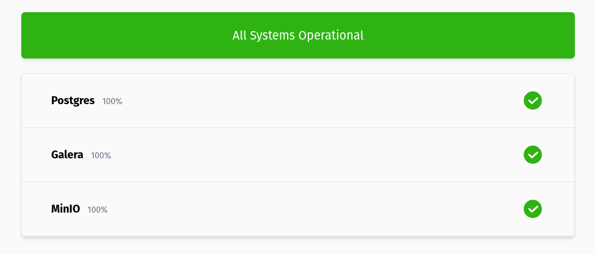

# PromPage



A stateless status page using data from prometheus. [Demo page](https://status.henrywhitaker.com/).

## Usage

### Configuration

The status page is configured using a yaml config file:

```yaml
datasources:
  - name: prometheus
    url: http://prometheus:9000
    type: prometheus
  - name: datadog
    url: https://api.datadoghq.eu
    token: XXXXXXXX
    type: datadog

services:
  - name: Postgres
    # Optional. Group services together
    group: Infra
    query:
      # If multiple values are returned, only the first one is used
      query: sum(pg_up)
      # The expressions uses https://expr-lang.org and must evaluate to true/false
      expression: float(pg_up) == 1
      # Optional. The time range to calculate the uptime percentage with (default: 24h)
      range: 24h
      # Optional. The resoltuion of the range query (default: 5m)
      step: 5m
      # Optional. Whether to generate graphs based on raw values or boolean values (default: false)
      bool: false
      # Optional. The units to display on any graphs (default: null)
      units: ""
      # Optional. The datasource to use for the query (default: prometheus)
      datasource: prometheus
# Settings to configure the UI
ui:
  # Optional. The title of the page (default: Status Page)
  title: Status Page
  # Optional. The interval that the page reloads on (default: 30s)
  refresh: 30s
  # Optional. Configure graph settings
  graphs:
    # The maximum number of data points to display on the graph (default: 200)
    points: 200
```

## Installation

### Helm

```
helm install prompage oci://ghcr.io/henrywhitaker3/prompage-helm
```

See the [values file](https://github.com/henrywhitaker3/prompage/blob/main/chart/values.yaml) for configuration options

### Docker

With a file in the working directory called `prompage.yaml`:

```
docker run -p 3000:3000 -v $(pwd)/prompage.yaml:/prompage.yaml ghcr.io/henrywhitaker3/prompage:latest serve
```
