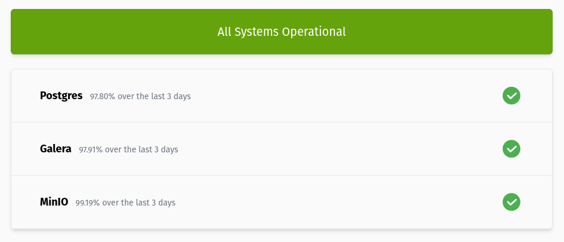

# PromPage



A stateless status page using data from prometheus

## Usage

### Configuration

The status page is configured using a yaml config file:

```yaml
# The url of the prometheus instance you want to query
prometheus: http://prometheus:9090
services:
  - name: Postgres
    query:
      # If multiple values are returned, only the first one is used
      query: sum(pg_up)
      # The expressions uses https://expr-lang.org and must evaluate to true/false
      expression: float(pg_up) == 1
      # The time range to calculate the uptime percentage with (default: 7d)
      range: 7d
      # The resoltuion of the range query (default: 5m)
      step: 5m
```

## Installation

### Helm

```
helm install my-generic oci://ghcr.io/henrywhitaker3/generic
```

See the [values file](https://github.com/henrywhitaker3/prompage/blob/main/chart/values.yaml) for configuration options

### Docker

With a file in the working directory called `prompage.yaml`:

```
docker run -p 3000:3000 -v $(pwd)/prompage.yaml:/prompage.yaml ghcr.io/henrywhitaker3/prompage:latest serve
```
